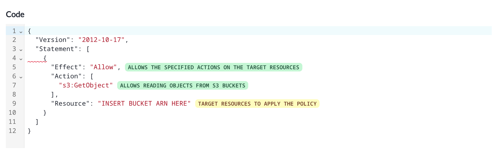
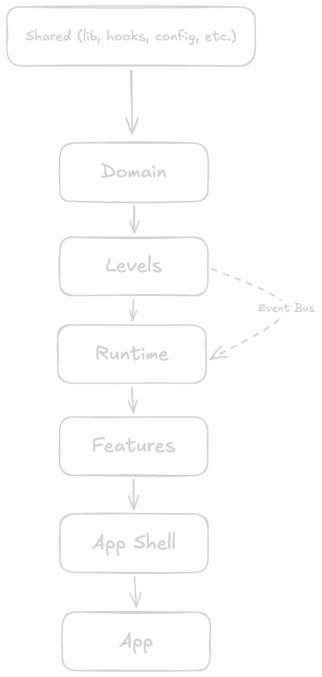

# Architecture

Learn AWS IAM is an interactive browser tutorial that teaches IAM concepts through 12 hands-on levels, each built around a visual entity canvas and a dedicated XState state machine.

## Contents

- [Tech Stack](#tech-stack)
- [How the Pieces Fit Together](#how-the-pieces-fit-together)
- [State Machines](#state-machines)
- [The Canvas System](#the-canvas-system)
- [Policy Editor](#policy-editor)
- [Tutorial Content](#tutorial-content)
- [Project Layout](#project-layout)
- [Common Patterns](#common-patterns)
- [Testing Approach](#testing-approach)
- [Known Limitations](#known-limitations)
- [Building and Deploying](#building-and-deploying)

## Tech Stack

**Frontend core**: React with TypeScript, bundled with Vite. The project initially used Create React App but later migrated to Vite for faster builds and better DX.

**State management**: XState handles orchestrating each level's flow, including tutorial content, objective tracking, and what nodes and edges currently exist in the level. `@xstate/store` is used for the more lightweight state management part of the project.

**Canvas**: Using ReactFlow (`@xyflow/react`) to render the graph of IAM entities and the relationships between them.

**Code editing**: A JSON policy editor built on CodeMirror 6, with AJV validating written policies against JSON schemas in real time.

**UI components**: Chakra UI for the component library, Framer Motion for animations. Markdown content goes through `react-markdown` with some custom plugins for integration with Chakra's theming and providing extra extensions like badges and inline icons.

**Testing**: Unit and integration tests using Vitest, and End-to-end tests with Playwright. The E2E tests cover all 12 levels, walking through the various paths users can take.

**Deployment**: A production build is assembled using a simple multi-stage Docker image, with Nginx serving the build.

## How the Pieces Fit Together

The app has a few distinct layers:

1. **State machines** sit at the center. Each level has one. It tracks everything: which nodes exist, what edges connect them, which objectives are complete, what popup is showing, whether the user can interact with certain elements yet, etc. Every action the user performs on the canvas is emitted as an event to the current level's state machine (with few exceptions, see the following point), whether it's closing a popover that's showing on the canvas or connecting two nodes together.

2. **The Canvas**: The state machine is the source of truth for which entities exist on the canvas. A separate lightweight store handles UI-level state (positions, hover, dragging) that doesn't need to go through the machine. See [The Canvas System](#the-canvas-system) for details.

3. **The code editor** is where users write policies. The state of the editor is shared across components via a custom hook. When the user submits a policy, it is validated and the result is sent to the state machine.

4. **The tutorial system** controls the guided experience. Popups, popovers, and element restrictions all flow from the state machine's current state. Move to a new tutorial step, and the visible UI changes automatically.

5. **Stores** handle simpler state that does not require full state machine treatment, for both convenience and performance. The canvas has a dedicated store as mentioned above, and the code editor has one managing its own state, as well as other stores used for managing app-wide operations such as level-progression.

The provider hierarchy in [App.tsx](src/app/App.tsx) sets all this up:

```
ChakraProvider
  └── ModalProvider
        └── LevelsProgressionProvider
              └── ReactFlowProvider
```

`LevelsProgressionProvider` reads the current level from the store, spins up the appropriate state machine, and makes its actor available to everything below via context.

## State Machines

### Why state machines?

Each level follows a mostly linear flow with branches:
first show a popup, wait for a click, reveal certain nodes, highlight a button, validate what the user creates, and handle errors if they do something wrong. State machines are a very natural fit for this. Each tutorial step maps to a state, user actions drive transitions, and guards make sure the user can’t skip ahead or reach an invalid step.

Trying to implement the same flow without using state machines, ordering becomes implicit. Each effect reacts to state, state changes trigger other effects, and you end up reasoning about which effect fires first in a given render cycle rather than reading a transition table. A good example of this is the node deletion flow. The canvas needs to animate nodes out before removing them from the DOM, which means it needs to know exactly which nodes were deleted and hold onto them briefly after the machine has already moved on. With a diffing approach, you'd reconstruct that after the fact:

```typescript
const prevNodesRef = useRef(nodes);

useEffect(() => {
  const deletedIds = prevNodesRef.current
    .map(n => n.id)
    .filter(id => !nodes.find(n => n.id === id));

  // The problem this tries to solve is that the nodes are gone from the machine context when this runs
  // We're trying to capture nodes that were already deleted just to animate them out.
  setDeletingNodes(prev => [
    ...prev,
    ...prevNodesRef.current.filter(n => deletedIds.includes(n.id)),
  ]);

  setTimeout(() => {
    setDeletingNodes(prev => prev.filter(n => !deletedIds.includes(n.id)));
  }, 500);

  prevNodesRef.current = nodes;
}, [nodes]);
```

With the machine emitting `NODES_DELETED` with IDs, none of that scaffolding exists. The machine knew what it deleted at the moment it decided to delete it, and it simply tells you exactly that.

Machines also need to be serializable so that the user's level progress can be saved at certain parts as checkpoints. For this reason, runtime-dependent logic lives outside the machine definition in `level-runtime-fns.ts` and is injected into the machine context on runtime as needed.

These per-level function maps are aggregated by [functions-registry.ts](src/runtime/functions-registry.ts) in runtime/, which provides the centralized lookup used at runtime. See [Functions Registry](#functions-registry) for details.

### Levels Structure

Each level is defined in [src/levels/level{N}/](src/levels/) with the following structure:

```
level5/
├── state-machine.ts         # The XState machine definition
├── initial-connections.ts   # What connections to initially show on the canvas
├── level-runtime-fns.ts     # Functions used for runtime hydration, since machines must be serializable for snapshotting
├── nodes/                   # The various nodes to show during the lifecycle of the level
├── objectives/              # Objective definitions and validation
│   ├── edge-connection-objectives.ts
│   ├── level-objectives.ts
│   ├── role-creation-objectives.ts
│   ├── trust-policy-edit-objectives.ts
│   └── user-group-creation-objectives.ts
├── schemas/                 # JSON schemas for validation
├── tutorial_messages/       # Tutorial content
│   ├── fixed-popover-messages.ts
│   ├── popover-tutorial-messages.ts
│   └── popup-tutorial-messages.ts
└── types/                   # Level-specific TypeScript types and enums
```

All twelve machines share a common setup via [common-state-machine-setup.ts](src/levels/common-state-machine-setup.ts).
This factory function defines shared actions, guards, and event handling logic.
Each individual level machine plugs in its own objectives, nodes, and tutorial flow.

The machine context represents the full state of a level:

- `nodes` and `edges`: what’s currently on the canvas
- `objectives`: the active goals and their completion state
- `show_popups`, `popup_content`, `show_popovers`, `popover_content`: tutorial and guidance state
- `restricted_elements`: which UI elements are currently hidden / greyed out so users can't interact with them.

Objectives revolve around creating policies and establishing edges between nodes. Objectives concerned with policy creation must provide a JSON schema to validate the policy the user writes inside the code editor.

It's important for state machines to be fully serializable, since we need to store a snapshot of the machine during specific points in each level to maintain users' progress as checkpoints, hence runtime hydration is imperative. `level-runtime-fns.ts` in each level contains a plain object, mapping a policy node id to its runtime validation function - the function that runs when the user attempts to create that policy.

Shared top-level event handlers live in [shared-top-level-events.ts](src/levels/shared-top-level-events.ts). These handle common user actions - adding nodes, deleting nodes, updating policies - using the shared logic from the common setup. Each level then extends this base configuration with its own transitions and constraints.

### Event emission

In certain circumstances, state machines need to inform different parts of our app (mainly the canvas system) about changes that need to be visible to the user. Examples of these changes include deleting nodes, creating nodes, clearing the canvas and more. Some of these changes happen due to user intervention, while others simply happen automatically as the user progresses through the level. Events the machine emits include:

- `NODES_ADDED`
- `NODES_DELETED`
- `NODES_RESET`
- `EDGES_ADDED`
- `EDGES_DELETED`
- `EDGES_RESET`
- `NODE_UPDATED`
- `OBJECTIVE_COMPLETED`

The canvas layer subscribes to those events and decides how to reflect them on screen:

```typescript
levelActor.on('NODES_DELETED', ({ nodeIds }) => {
  canvasStore.send({ type: 'markNodesForDeletion', nodeIds });
  // Animation plays, then nodes actually disappear
});
```

> levelActor.on is an XState built-in event subscription API

This indirection exists specifically because of animations. Without it, nodes deleted by the machine would vanish from the DOM immediately before any exit animation could run. The event gives the canvas a window to animate first.
The deletion flow has three steps:

1. Machine emits `NODES_DELETED` with IDs
2. Canvas store marks those nodes as "deleting", triggering Framer Motion exit animations
3. On animation completion, another action removes the nodes from the canvas store for good

Skipping the indirection and instead diffing prev/next node arrays in a useEffect would technically work, but you'd lose the IDs of what was deleted the moment the machine context updates: the diff would tell you that nodes were removed, but only against the current render snapshot, not which specific nodes the machine intended to remove.

### Cross-layer event bus

State machines (in `levels/`) occasionally need to trigger side effects that live inside `runtime/` - specifically, saving a level checkpoint when the machine reaches a certain state. Using a direct import would cause a cycle, as `runtime/` already imports every level's state machine (since runtime is responsible for serving the correct level the user is at), and we would rather keep dependencies flowing in one direction. Moving these actions required by the state machines into a separate directory would work; however, these actions are inherently runtime concerns that belong in the runtime directory.

To solve this dependency, we use a simple, typed pub/sub bus defined in [level-event-bus.ts](src/levels/level-event-bus.ts) for communication upwards. The underlying implementation uses the generic `createEventBus` factory in [src/lib/event-bus.ts](src/lib/event-bus.ts).

For the emitter side (inside `common-state-machine-setup.ts`):

```typescript
LevelEventBus.emit('store_checkpoint', { actor: self as Actor<AnyActorLogic> });
```

For the subscriber side (in `runtime/level-operations.ts`, which wires up the handlers once on module load):

```typescript
LevelEventBus.on('store_checkpoint', ({ actor }) => storeLevelCheckpoint(actor));
```

Since both modules currently import only a dependency from lib/, cyclic dependencies are avoided.

The event bus is intentionally minimal: no middleware, no ordering guarantees, no async support. It is used only for fire-and-forget side effects, where the state machine does not need a response.

### Functions registry

Checkpointing requires the machine snapshot to survive JSON serialization. That rules out functions in machine context entirely. However, objectives need validator functions, and guard rails need filter functions for runtime connection checks. The workaround is [functions-registry.ts](src/runtime/functions-registry.ts): a plain object mapping each level to the functions it needs.

```typescript
FunctionsRegistry[5].validate_functions['create_admin_policy'];
FunctionsRegistry[5].objectives_guard_rails_blocked_edges_fns['scp_blocks_s3'];
// etc.
```

The machine stores the function _name_, and when an action actually runs (validating a policy, checking a guard rail) it calls into the registry with the level number and the stored name to get the real function. Checkpoint restoration works transparently because the snapshot only ever contained the name, so there's nothing to re-inject: the next time the action fires, it looks up the registry the same way it would have on a fresh start.

## The Canvas System

The canvas renders IAM entities as draggable nodes, with edges representing the relationships between them. The state machine owns which nodes and edges exist; an @xstate/store instance owns UI-level concerns (positions, hover, selection). The machine's emitted events feed directly into the store, with no reconciliation logic needed.

@xstate/store fits here rather than Zustand or plain React context because it speaks the same event language as the main machine, it's already in the dependency tree, and drag/hover interactions can update the store at full frequency without touching the machine.

The data flow looks like this:

```
State machine -> useCanvas hook -> canvas store -> ReactFlow rendering.
```

### What lives where

The canvas code is in [src/features/canvas/](src/features/canvas/):

- `components/`: node and edge components, as well as other canvas-related UI components
- `hooks/useCanvas.ts`: the main hook providing the entire state of the canvas
- `stores/canvas-store.ts`: the store that holds canvas UI state (hover, selection, etc.)
- `utils/`: positioning math and connection validation (this will likely move elsewhere over time)

### Node types

ReactFlow needs a map of node types to components:

```typescript
{
  policy: IAMCanvasNode,
  user: IAMCanvasNode,
  iam_group: IAMCanvasNode,  // 'group' is reserved by ReactFlow
  role: IAMCanvasNode,
  resource: IAMCanvasNode,
  account: AccountCanvasNode,
  ou: IAMCanvasNode,
  scp: IAMCanvasNode,
  resource_policy: IAMCanvasNode,
  permission_boundary: IAMCanvasNode,
  user_aggregated: IAMCanvasNode,
}
```

Most entities use `IAMCanvasNode`, which reads the entity type from node data and renders accordingly. Account nodes use `AccountCanvasNode` components. Account nodes are separate because AWS accounts need special layout treatment as they contain other entities visually nested inside them.

### The canvas store

This is an `@xstate/store`, not a full state machine. It's the store that sits between the level's state machine and the canvas shown to the user, it holds:

- The current set of nodes and edges (synced from the level machine)
- Which node or edge is selected or hovered
- The position of each node on the canvas
- Which nodes are in the middle of a delete animation
- Which node has its content / ARN / tags panel open
- Side panel visibility state

### useCanvas hook

This hook ([useCanvas.ts](src/features/canvas/hooks/useCanvas.ts)) is the glue of several sub-hooks each responsible for a different aspect of the canvas:

1. Subscribes to events from the level's state machine
2. Translates them into canvas store actions
3. Handles connection validation when users try to draw edges
4. Manages the animation timing for adds/deletes

When a user drags a connection, `useCanvas` runs it through validation (through the ([useCanvasHandlers.ts](src/features/canvas/hooks/useCanvasHandlers.ts)) hook) before sending an `ADD_EDGE` event to the machine:

1. Check [edges-creation.ts](src/features/canvas/utils/edges-creation.ts) utility: is this entity pair even allowed?
2. Check `edges_management_disabled` in the machine context: are connections allowed at this point in the level?
3. Check `blocked_connections` in the machine context: is this specific connection blocked right now?
4. If all pass, send `ADD_EDGE` to the machine

### Layout groups

When a level starts, nodes need to appear in sensible positions. Users shouldn’t have to untangle a mess before they can start learning.
For this, each node has a `layout_group_id` drawn from the `CommonLayoutGroupID` enum, with values like `CenterHorizontal`, `BottomLeftVertical`, `TopCenterHorizontal`. The canvas uses this along with a few runtime factors to calculate where nodes should go:

- Current viewport size
- Side panel width (if it’s open)
- How many other nodes are already in the same group
- The group’s direction (horizontal or vertical) and spacing rules

This logic lives in `positionNewNodes()` in `apply-node-positions.ts`, called from the canvas store when nodes are added.
When new nodes are introduced, they get placed automatically while existing nodes are left exactly where the user put them.

Account nodes are a special case: they ignore the side panel offset since they contain other nodes visually and need stable positioning. Child nodes (nodes with a `parentId`) are grouped relative to their parent rather than the global canvas.

### Animations

Animations in this project mainly revolve around nodes and edges on the canvas, handled by Framer Motion transitions. Animations happen during the following operations:

- **Node creation**: Nodes scale up from 0.85 and fade in over 0.25s. There's also a 2-second gradient pulse effect that plays once on entry.
- **Node deletion**: Nodes blur slightly and drift upward while fading out over 0.5s.
- **Edge creation**: New edges get a 7-second glow animation.
- **Edge deletion**: Edges fade out with a slight blur over 0.5s.

> Deletion animations have two underlying phases. The machine notifies the canvas that a node or edge is deleted; the canvas marks it as deleting and starts the animation. Once the animation completes, the node or edge is removed from the canvas store.

### Shared logic and XState's extensibility limits

Sharing actions and guards across machines works fine through `createStateMachineSetup`. Sharing _event definitions_ doesn't, and this is a hard XState limitation, not a local design decision.

XState's type safety inside machine definitions depends on contextual typing, the mechanism that tells an action "you're handling this specific event, here are its payload properties." When you introduce a generic like `TFinishEventMap` to share event types across machines, the events union ends up with an unresolved generic branch. TypeScript can't eliminate it at the call site, so discriminated union narrowing breaks: guards and actions stop seeing the concrete event types they're supposed to be handling.

The correct XState solution would be `createStateConfig`: modular typed state nodes with their own event handlers that machines can compose. That hits the same wall for the same reason.

The workaround is `SHARED_TOP_LEVEL_EVENTS`, a plain object spread into each machine's `on:` config:

```typescript
on: {
  ...SHARED_TOP_LEVEL_EVENTS,
}
```

It works, but it's loosely typed.

## Policy Editor

Most of the objectives in each level revolve around creating policies, which are merely JSON documents following a specific schema. Each policy creation objective must follow a specific schema in order for the user to be able to submit and finish the objective.

The **Policy Editor** is the place where the user writes down the policy for the objective

### Implementation

The editor lives in [src/features/code_editor/](src/features/code_editor/). The code editor popup is `CodeEditor.tsx` and it supports two kinds of policy management: Creating a policy from scratch and editing a policy.

CodeMirror 6 powers the actual editing. It's configured with:

- JSON syntax highlighting and folding
- Validating the written policy on each keystroke with AJV validation
- A custom badge extension that renders help icons inline where the user might need help

CodeMirror has the ability to manage its own internal state without intervention from React. In normal circumstance, This is sufficient. However, in our case, we still impose structure and control around it using a custom hook [useCodeEditor.tsx](src/features/code_editor/hooks/useCodeEditor.ts), since the editor's state must be shared across multiple components.

### Code Editor Validation

The editor validates policy JSON on two levels.

First, basic structure and syntax checking using shared schemas in [`src/domain/policy-schemas/`](src/domain/policy-schemas/):

- `aws-iam-policy-schema.json`: standard IAM policy format
- `aws-iam-role-trust-policy-schema.json`: the specific format for role trust policies
- `aws-iam-shared-definitions-schema.json`: shared JSON Schema $definitions (Statement structure, Action, Principal, Resource, and condition operators) $ref'd by the other policy schemas
- `aws-iam-resource-policy-schema.json` - the specific format for resource policies

On top of that, individual creation objectives can attach their own validation rules.
Those live under each level’s `schemas/` directory. For example, in level 5 the EC2 role objective validates against `ec2-role-schema.json`, which enforces that the trust policy explicitly includes `ec2.amazonaws.com` as the service principal.

At runtime, each level’s `level-runtime-fns.ts` file maps node IDs to the schema they should use. AJV compiles all of those validators once when the level loads and reuses them for the lifetime of the level.

### Tabs

The editor supports multiple policy types in tabs:

- Customer Managed Policy
- Role Trust Policy
- Service Control Policy (SCP)
- Resource Policy
- Permission Boundary

In most levels, only a small subset of these options will be rendered. The rest is hidden through a state machine config in order not to confuse the user and keep info about things we haven't introduced the user to yet hidden.

### Help badges

The custom `badgeExtension` in CodeMirror renders small badge-like icons next to certain lines. It leverages CodeMirror’s extension system to attach contextual hints and explanations directly to relevant parts of the policy while the user is editing it.



## Tutorial Content

Each level has a guided experience using three overlay types: popups (modal dialogs), popovers (attached to specific elements), and fixed popovers (anchored to a fixed part of the screen).

### Authoring

Tutorial content is written as plain strings in `tutorial_messages/popups.ts` and `popovers.ts` for each level. These are rendered using `react-markdown` with two custom plugins:

- `rehypeChakraBadge` turns `::badge[text]::` into styled Chakra badges
- `rehypeIcon` turns `::icon[IconName]::` into actual icon components

So tutorial authors can write:

```md
Click the ::badge[Create Policy]:: button to add a new policy.
Look for the ::icon[AddIcon]:: icon in the toolbar.
```

…and have it render with proper styling and inline icons in the UI.

### Flow control

The state machine drives what the user sees at any point in the tutorial. Each tutorial step is a machine state. Entering a state typically configures which overlay is visible, which UI elements are locked, and what event will advance the user to the next step.

Here's what a step that waits for the user to connect two nodes looks like:

```typescript
attach_policy_to_user: {
  entry: [
    'hide_popovers',
    { type: 'show_fixed_popover_message', params: { message: FIXED_POPOVER_MESSAGES[2] } },
    'enable_edges_management_ability',
  ],
  on: {
    [EdgeConnectionFinishEvent.PolicyAttachedToUser]: {
      target: 'next_step',
      actions: ['finish_level_objective', 'hide_fixed_popovers'],
    },
  },
},
```

Entry actions set everything up: hide the previous overlay, show the next one, unlock the relevant part of the UI. The transition fires on a domain event, not a generic "next" click, but a specific finish event emitted when the user completes the expected action. The outgoing actions clean up and mark the objective done.

Steps that just walk the user through information use `NEXT_POPUP` or `NEXT_POPOVER` events instead, which are sent when the user clicks the continue button in the overlay.

The three overlay types map to different UI treatments: popups are modal dialogs that block the canvas, popovers are attached to a specific element (via `popover_target`), and fixed popovers are anchored to a fixed position on screen and stay visible while the user interacts with the canvas.

### Element IDs

There is a central `ElementId` enum that ties several parts of the system together:

- Components (via `data-element-id` attributes)
- Tutorial popovers (via `popover_target`)
- E2E tests (via `getByTestId`)
- Restriction logic (via `restricted_elements`)

This keeps everything in sync. When a new interactive element is introduced, it only needs an entry in the enum. From there, it can immediately be targeted by tutorials and e2e tests.

> For targeting elements with popovers, component must be explicitly wrapped in a `TutorialPopover` component and provided with the corresponding `ElementId`. And for element restriction, the component itself must read from the `useIsElementRestricted` hook and decide how to handle the restricted state (hide, disable, etc.)

## Project Layout

The code is organized as follows:

```
src/
├── app/                  # App root component
├── app_shell/            # Glue for main app layout, including side panels and top bar
├── components/           # Shared UI, domain-agnostic components
├── config/               # Constants, element IDs
├── domain/               # IAM graph logic, node/edge factories, policy schemas, provides shared domain-specific logic for the app
│   ├── nodes/            # Node factory functions per entity type
│   └── policy-schemas/   # JSON schemas for policy validation
│
├── features/
│   ├── canvas/           # ReactFlow rendering, canvas store, layout
│   ├── code_editor/      # CodeMirror, policy editing, validation
│   ├── iam_entities/     # Entity creation dialogs
│   └── level_progress/   # Level selection and progress UI
│
├── hooks/                # Custom React hooks
├── levels/
│   ├── level1/ through level12/  # Per-level definitions
│   ├── common-state-machine-setup.ts
│   ├── shared-top-level-events.ts
│   ├── functions-registry.ts
│   ├── types/            # Level-specific types
│   └── utils/            # Shared level utilities
│
├── lib/                  # Analytics, storage, markdown plugins
├── runtime/              # Level lifecycle, persistence, provider
├── stores/               # @xstate/store instances
└── types/                # TypeScript definitions
```

### Project Structure Philosophy



Dependencies flow downward. Upper layers import from lower layers; lower layers never import from upper ones. The event bus is the one exception; it lets `levels/` communicate upward to `runtime/` without creating a cycle (see [Cross-layer event bus](#cross-layer-event-bus)).

- **`lib/`** and **`types/`** are the foundation. Generic utilities (event bus, storage, markdown processing), shared TypeScript types and enums. Nothing in the codebase is off-limits for importing from here.
- **`domain/`** contains domain-specific logic for IAM: node and edge factories, ARN generation, policy validation schemas, graph utilities. It knows what an IAM User or Role looks like, but nothing about levels, tutorial flow, or the canvas.
- **`levels/`** defines what each level contains and how it progresses. It uses `domain/` factories to build nodes and edges, and defines the XState machine, objectives, tutorial messages, and runtime validation functions. Twelve self-contained folders; understanding level 5 requires no knowledge of level 4 or 6.
- **`runtime/`** is responsible for serving the correct level machine to the app. It loads machines from `levels/`, handles snapshotting and persistence, registers level-specific functions that can't live inside a serializable machine snapshot, and exposes the `LevelsProgressionProvider`.
- **`features/`** is purely about rendering. The canvas, the code editor, the IAM entity creation dialogs, and the level progress panel all live here. These components subscribe to the state machine actor and the canvas/editor stores; they do not contain level logic.
- **`app_shell/`** and **`app/`** sit at the top. `app_shell/` assembles the navigation bar and fixed overlays. `app/` is the root: it wires up the provider hierarchy and renders the shell.

## Common Patterns

### Factory functions

Constructing nodes, edges, and objectives is a core pattern that happens across all levels. Rather than doing it inline and dirtying the repo with boilerplate, factory functions with consistent defaults are used across the codebase.

```typescript
const policy = createPolicyNode({
  id: 'my-policy',
  label: 'AdminAccess',
  layout_group_id: 'center',
});
```

Node factories live in [`src/domain/nodes/`](src/domain/nodes/), with one factory per entity type. Edge and layout group factories are in [`src/domain/`](src/domain/).

### Hooks

The hooks in [src/hooks/](src/hooks/) offer the same functionality but composable within a component:

```typescript
function MyButton() {
  const restricted = useIsElementRestricted(ElementId.MyButton);
  const { isPopoverActive } = useTutorialPopover(ElementId.MyButton);

  if (restricted) return null;
  return <Button>...</Button>;
}
```

Hooks provide shared state and logic for common patterns across the app, such as checking if an element is current restricted (The consuming component decides what "restricted" means, ie: hidden, disabled, etc.), or whether a tutorial popover is active for a given element.

The project initially used HOC (Higher Order Components) for these patterns, but has gradually shifted towards hooks for better composability. For example, an element might be a target for restriction and for popovers at the same time, and with HOCs we would have to wrap the component twice, while with hooks we can simply call both hooks inside the component and let it decide how to use the returned values.

### The provider stack

[LevelsProgressionProvider.tsx](src/runtime/LevelsProgressionProvider.tsx) is responsible for serving the current level's state machine to the app, it does so by:

1. Subscribes to `LevelDetailsStore` for the current `levelNumber` and `restartKey` through a `useEffect` hook
2. On either change, clears the active actor context and calls `loadCheckpoint` to check localStorage for a saved snapshot
3. It then calls `getActorContext(levelNumber, snapshot)` to fetch the state machine corresponding to the `levelNumber` from the registry inside `src/runtime/level-runtime` and creates an XState actor context, potentially hydrating it with the snapshot if it exists
4. Before the actor context is ready, it renders null to halt the previous machine from receiving/sending events. This would also come in handy if we were to use code splitting for machines in the future, as loading the machine would take longer in that case.

If either keys (`currentLevelNumber` or `restartKey`) changes, the provider re-runs the effect. `restartKey` is merely used for when the user wishes to restart the level from scratch again.

## Known Limitations

**Snapshot schema drift**: When a level's machine context shape changes, existing snapshots become invalid. [level-persistence.ts](src/runtime/level-persistence.ts) handles this by dropping the stale snapshot and restarting the level. There is no migration path: a context shape change is a breaking change for any user mid-level.

**No canvas/machine reconciliation**: The machine is the source of truth for which nodes exist, but if the canvas store drifts out of sync (a missed event, a silent failure), there's no mechanism to detect or recover from it. The machine thinks a node exists; nothing is rendered. This hasn't happened in practice, but the gap is real.

**Auto-layout doesn't scale**: `positionNewNodes()` inside [`src/features/canvas/utils/apply-node-positions.ts`](src/features/canvas/utils/apply-node-positions.ts) works for the node counts each level is designed around. Level complexity is intentionally bounded, so this isn't a current problem, but it's a real ceiling if levels ever grow significantly larger. Level 12 is a borderline example where the layout logic is stretched thin.

**Generating Snapshots is manual**: There's no automated script for generating snapshots at the moment. If a level's machine changes, snapshots must be regenerated manually by running the level to the desired point and exporting the snapshot via the helper endpoint. This is a manual process that can be time-consuming, especially for levels with long sequences of interactions.

## Testing Approach

Integration tests and unit tests are implemented with Vitest, while end-to-end tests are implemented with Playwright.

### Running tests

```bash
yarn test                              # Vitest - unit and integration tests
yarn playwright test                   # Playwright - all E2E tests
yarn playwright test tests/e2e/level5  # Playwright - single level
```

Playwright's `webServer` config in [`playwright.config.ts`](playwright.config.ts) starts the dev server automatically before the suite runs (`VITE_APP_ENV=CI yarn dev`). Locally it reuses an already-running server on port 5173 if one exists; in CI it always starts a fresh one.

### End-to-end with Playwright

E2E tests in [`tests/e2e/`](tests/e2e/) cover all 12 levels. Each level has its own spec file covering all the scenarios a user could take, including wrong answers, incorrect policy structures, and alternative completion paths.

Aside from the separate test files, custom test fixtures are implemented to provide abstract, high-level testing primitives that aid in testing the Canvas UI, such as testing whether a node exists, a popup is shown and what content is inside it, etc.

The following fixtures are used across all tests

- `tutorial` - provides assertions and actions related to popups, popovers, and miscellaneous tutorial-related UI such as the side panel
- `nodes` - provides assertions and common actions related to nodes, such as asserting that a node is shown/hidden, clicking on a node's buttons, etc.
- `edges` - same as `nodes` but for edges
- `goToLevel/goToLevelAtStage` - helps with initializing the app at a specific level, or at a specific stage within a level by loading the stage's snapshot file

Other helper, non-fixture utilities such as [`connection-helpers`](tests/e2e/helpers/connection-helpers.ts) and [`locator-helpers`](tests/e2e/helpers/locator-helpers.ts) encapsulate common operations such as connecting nodes together and locating nodes/edges by their labels or other attributes, ultimately keeping test cases concise.

### Stage snapshots

E2E tests don't only cover the linear happy path of each level, they also cover the various branches users could take in order to complete the level, this includes making mistakes such as creating incorrect policies, connecting wrong nodes together, etc. levels also might not follow a completely linear path, multiple paths might lead to completing the levels and E2E tests aim to cover as many of these paths as possible.

To aid with this, stage snapshots are used to save the state of the level at specific points in time, such as right after finishing a specific tutorial step, or right before an important decision point where the user can take multiple paths from there.

This approach substantially reduces test runtime, since we won't have to replay each level from the start for every test case. It also makes tests more focused and deterministic, since they start from a known state rather than relying on a long sequence of interactions to get there.

With that being said, it does introduce some maintenance overhead. If we were to change a level's state machine, the snapshots for the level would likely break and need to be regenerated.

Snapshots are generated using the `store_snapshot_to_disk` action, which is available in every level's state machine via the common setup. Place it as an `entry` action at the state you want to capture:

```typescript
entry: [{ type: 'store_snapshot_to_disk', params: { filename: 'stage3' } }];
```

When triggered, it POSTs the current machine snapshot to [`scripts/snapshot-server.mjs`](scripts/snapshot-server.mjs), a plain Node.js HTTP server running on port 3001. The server gzip-compresses the snapshot, base64-encodes it, and writes it to `tests/e2e/level{N}/snapshots/{filename}.txt`. It needs to be started manually in a separate terminal before playing through the level:

```bash
node scripts/snapshot-server.mjs
```

Then play through the level to the point where the action fires. Remove the action from the state machine once the snapshot has been captured. Those `.txt` files are committed to the repo and loaded by `goToLevelAtStage` at test time. If a level's machine context shape changes, its snapshots need to be regenerated.

Policy solutions used in E2E tests are stored in the same compressed format under `tests/e2e/level{N}/policies/`. [`scripts/compress-policy.mjs`](scripts/compress-policy.mjs) takes a raw JSON policy file and produces the compressed output; `getTestSolution` in [`tests/e2e/helpers/test-solutions.ts`](tests/e2e/helpers/test-solutions.ts) decodes it at test time. They're stored compressed to discourage casual browsing of answers.

### Unit tests with Vitest

Unit tests cover utility functions, levels' state machine logic such as connecting nodes together, creating nodes, deleting edges, etc.
These tests are quite important since some scenarios can get convoluted, for instance: deleting an edge connecting an identity policy to a group node should also delete edges connecting users belonging to that group with the resources the policy was granting access to.

> Unit tests have the `unit.test.ts` suffix, they reside within the same folder as the code they test.

### Integration tests with Vitest

Integration tests tend to cover the common state machine actions like creating nodes, creating edges, validating policies, etc. within a context of a specific level. For instance, testing that creating a node inside a level that has a create node objective will trigger the validation function of the objective and emit the correct finish event if the created node satisfies the objective requirements.

> Integration tests have the `integration.test.ts` suffix, they reside within the same folder as the code they test.

## Building and Deploying

There's a Makefile in the root of the project that serves as an entry point for the most common operations. `make help` lists all available commands:

```bash
$ make help
Targets:
  run-dev     Run dev server in Docker
  build-prod  Build production image
  run-prod    Run production image locally
  push-prod   Push image (REGISTRY required)
```

### Development

```bash
make run-dev
```

This builds and runs a Docker container running the code in development mode. The app appears at `localhost:5173`.

Vite handles bundling with:

- Path alias `@` → `src/`
- Node polyfills for browser compatibility
- TypeScript checking on save

### Production build

```bash
make build-prod
```

This builds a production Docker image containing the production-ready bundled frontend, alongside a simple nginx server serving the build

The [Dockerfile](Dockerfile) has two stages:

1. **Builder**: Node 24 Alpine image, it installs dependencies via Yarn 4, and runs `yarn build`
2. **Runtime**: Nginx Alpine, copies the built `dist/` from the previous stage and serves it

The final image is small - just nginx with the bundled frontend

### Code splitting

When running `yarn build` to trigger a production build, multiple chunks are produced. Vendor dependencies are split via `manualChunks` in [`vite.config.mts`](vite.config.mts):

- `editor`: CodeMirror packages
- `chakra`: Chakra UI, Emotion, Framer Motion
- `reactflow`: `@xyflow/react`
- `xstate`: XState and its React/store packages
- `misc`: lodash, react-markdown, immer, ajv

Each level’s state machine is a separate dynamic import in [`level-runtime.ts`](src/runtime/level-runtime.ts), so Vite gives each level its own chunk. Only the machine for the current level is downloaded when the user navigates to it. `LevelsProgressionProvider` loads the machine asynchronously; while it’s fetching it renders a full-screen spinner, and the app tree only mounts once the actor is ready.

The code editor is also lazily loaded via its own chunks. In [`CodeEditorLoader.tsx`](src/features/code_editor/components/CodeEditorLoader.tsx), the editor’s chunk is deferred with `React.lazy()` until the user opens the editor. A `Suspense` boundary shows a spinner until the editor fully loads.

### Scripts

From `package.json`:

- `yarn dev` - For starting the Vite dev server
- `yarn build` - For building the app for production
- `yarn test` - For running Vitest unit tests
- `yarn lint` / `yarn lint:fix` - For running ESLint
- `yarn format` - For running Prettier

The Makefile wraps Docker operations as mentioned above.
