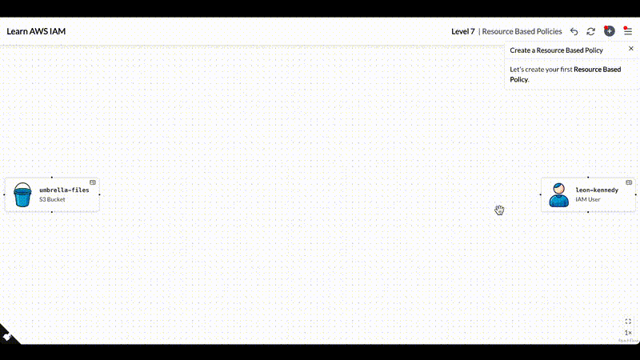

# Learn AWS IAM Interactively

An interactive visual simulator for learning AWS IAM (Identity and Access Management). No AWS account required.

> This project is not affiliated with or endorsed by Amazon Web Services (AWS).


[](https://opensource.org/licenses/MIT)



**[Try it live — no setup required](https://learnawsiam.com)**

## What This Is

A visual interactive learning simulator for AWS IAM aimed at developers and anyone working with AWS. Inspired by [learn-git-branching](https://github.com/pcottle/learnGitBranching), it presents real-world access management scenarios that you solve using IAM.

Users will write real IAM policies, attach them to users, groups, roles, and other resources, and see the effects of their changes in real time. The goal is to provide an intuitive, practical learning experience that helps you master the core principles of AWS IAM.

## Features

- **12 progressive levels** - Covering basic scenarios to the more advanced ones revolving around multi-account access and real-world complex scenarios
- **Visual canvas** - You will learn with an interactive visual canvas, where everything is presented as nodes and edges
- **Integrated policy editor with continuous feedback loop** - You write real JSON policies and see real-time feedback on what you write
- **Guided tutorials** - Each level walks you through the concepts before you solve it
- **Runs entirely in the browser** — all IAM simulation logic is client-side. No AWS credentials or infrastructure required. The only backend is a small stats tracker

## Topics Covered

| Levels | Topic                                                                                |
| ------ | ------------------------------------------------------------------------------------ |
| 1–4    | Introduction to IAM basics, users, groups, and identity policies                     |
| 5–6    | Using IAM roles, cross-account access, and resource-based policies                   |
| 7–10   | Writing complex policies with tag-based access control through the use of conditions |
| 11–12  | Utilizing IAM guardrails, e.g., SCP and permission boundaries                        |

## Built With

- **React + TypeScript** - The core UI library and language for the frontend
- **XState** - State management for complex level logic and the IAM simulation engine
- **ReactFlow** - Interactive graph visualization for the canvas and node-based UI
- **CodeMirror** - Used for the integrated policy editor with real-time feedback
- **Chakra UI** - Component library for pretty much every UI element you see

For detailed architecture, see [ARCHITECTURE.md](ARCHITECTURE.md)

## Run Locally

The site at **[learnawsiam.com](https://learnawsiam.com)** serves the same static build — all the logic runs in your browser, no server-side processing. To run it yourself:

**Prerequisites:** Docker

```bash
git clone git@github.com:laythra/learnawsiam.git
cd learnawsiam
make run-dev
```

## Contributing

Contributions are welcome. If you're interested in contributing in any form (bug fixes, docs, new levels), please open an issue or fork the repo and submit a pull request. For major changes (like adding a new level or changing the core mechanics), please open an issue first to discuss what you would like to change.

See [ARCHITECTURE.md](ARCHITECTURE.md) for an overview of the codebase before diving in.
